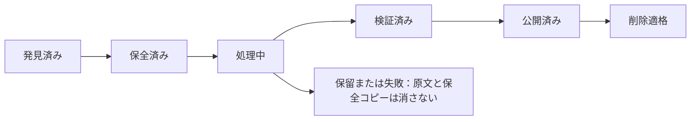

# 会話圧縮コンパイラ 設計

会話ログ（transcript）を削除する前に、残す価値のある内容を知識へ圧縮する機構の設計である。
2026-09-15 に作成した。Claude Fable 5.1 と GPT-6 Astra の 2 案を統合し、実データで検証して内容を確定した。

原案は同じディレクトリに残してある。

- `design-fable.md` — Claude Fable 5.1 の案
- `design-astra.md` — GPT-6 Astra の案

## 1. なぜ作るか

会話ログは `~/.claude/projects/<project>/<session-id>.jsonl` に溜まる。2026-09-15 時点で 2,391 本、6.60 GB、最大 1 本が 124.6 MB ある。

Claude Code は既定で 30 日を過ぎたログを起動時に削除する（`cleanupPeriodDays` は未設定）。実際、30 日を超えるログは 38 本しか残っていない。

つまり現状は、**過去の判断・方針・つまずきの記録が、誰も読まないまま 30 日で消えている**。消える前に残す価値のある内容だけを取り出し、既存の永続メモリへ落としたい。

この機構自体がメモリを食ってはならない。2026-09-15 のクラッシュは、hook が 109 MB のログを丸ごと読んで 1,070 MB 使ったことが増幅要因になった。

## 2. 確定した骨格

2 案で一致した項目である。設計の前提として扱う。

| # | 項目 | 内容 |
|---|---|---|
| 1 | hook はキューに 1 行書くだけ | PreCompact で圧縮まで実行しない。hook のタイムアウトに収まらないためである。また、この時点ではコンパクション要約が追記されておらず、材料も揃わない |
| 2 | 機械処理と LLM の役割を分ける | 機械的に絞ってから LLM に渡す。LLM の出力を別モデルが検証する |
| 3 | 根拠を必須にする | 保存する事実には原文の逐語引用と出典 ID を付ける。引用が原文に無い事実は機械的に捨てる |
| 4 | 検証を通っていないログは消さない | 状態が「検証済み」でないファイルは削除対象にしない |
| 5 | 原文を先に保全する | 圧縮の前に復元できるコピーを作る。知識抽出が失敗しても原文へ戻れる |
| 6 | 低メモリで動かす | 全文読み込みを禁止する。1 行ずつ読む。LLM プロセスは同時に 1 本だけ |
| 7 | 既存 memory の 2 書式に両対応 | 最上位 `type:` の旧形式と `metadata.type:` の新形式が混在している |

## 3. 実データで確認した事実

設計の根拠となる実測値である。2026-09-15 に測定した。

| 観点 | 実測 |
|---|---|
| 総量 | 2,391 本、6.60 GB。project 直下 593 本、サブエージェント 1,798 本 |
| サイズ分布 | 1 MiB 未満 1,514 本、10 MiB 以上 144 本、100 MiB 以上 2 本 |
| 年齢 | 7 日以内 498 本、7〜30 日 1,822 本、30 日超 38 本 |
| 1 行の最大 | **1.30 MB**。1 MiB を超える行が実在する |
| 可逆圧縮率 | **xz で 3.0〜8.6 分の 1**。大きいサブエージェントのログほど効かない |
| 自動削除 | `cleanupPeriodDays` 未設定。既定の 30 日で削除されている |
| MEMORY.md | 最大 46,227 バイトのものが実在する |

### 3.1 原案から訂正した前提

Fable 案は次の 3 点を誤っていた。本設計では実測値を採る。

| Fable 案の主張 | 実測 | 設計への影響 |
|---|---|---|
| 1 行の最大は 0.2 MB | 1.30 MB | 1 行にも上限処理が要る。Astra 案の 1 MiB 上限設計を採用する |
| MEMORY.md は 24,576 バイトが上限で満杯 | 46,227 バイトが実在 | 上限の根拠を確認できない。分割索引は必須ではなく、任意とする |
| xz で 8〜12 分の 1。6.7 GB が 0.8 GB になる | 3.0〜8.6 分の 1 | 保全後も 1.5 GB 前後残る。容量削減を主目的にしない |

### 3.2 使える素材

ログには、ゼロから要約するよりも有利な素材がすでに含まれている。

| 素材 | 中身 | 使い道 |
|---|---|---|
| `AskUserQuestion` の tool_use と tool_result | 質問・選択肢・ユーザーが選んだ回答 | ユーザーの決定そのもの。精度評価の自動正解にも使う |
| `isCompactSummary` のユーザー行 | コンパクション時に Claude が書いた一次要約 | 長いセッションほど揃う。抽出の土台にする |
| `away_summary` / `ai-title` / `last-prompt` | 離席時の進捗、セッション題名 | 短くて信号が濃い |
| `is_error: true` の tool_result | 失敗したツール呼び出し | 「つまずき」の検出点 |

## 4. 何を残し、何を捨てるか

### 4.1 判断の軸

**後のセッションが同じ調査をやり直す、同じ判断を蒸し返す、同じ失敗を繰り返す**ことを防ぐ情報だけを残す。ファイルの内容やコマンド出力など、再生成できるものは捨てる。

### 4.2 階層

| 階層 | 対象 | 扱い |
|---|---|---|
| S1 必ず残す | `AskUserQuestion` の質問・選択肢・回答 | 原文のまま |
| S1 | ユーザーの発言（`isMeta` でなく、スラッシュコマンドでないもの） | 原文のまま。1 件 2,000 字で切る |
| S1 | コンパクション要約 | 原文のまま |
| S1 | `away_summary` / `ai-title` / `last-prompt` | 原文のまま |
| S1 | `is_error: true` の tool_result | 末尾 300 字 |
| S2 条件付き | assistant の `text` ブロック | ターン末尾の本文だけ。1 件 1,500 字で切る |
| S2 | `SendMessage` の入力 | 500 字で切る。`summary` があればそれを優先 |
| S2 | `file-history-delta` / `pr-link` / `gitBranch` | ファイル名・PR 番号・ブランチ名だけ |
| S2 | tool_use の `input` | ツール名と、Bash なら `description` だけ |
| S3 捨てる | tool_result の本文、`thinking`、`attachment`、`queue-operation`、課金メタデータ | 捨てる |
| S3 | `tool-results/` 配下の別ファイル | 開かない。ファイル名とサイズだけ記録する |

### 4.3 発言の種別を分ける

保存する事実には、誰がどの立場で述べたかを必ず記録する。種別を混在させると、提案が決定として残る。

| 種別 | 意味 |
|---|---|
| ユーザーの明示決定 | ユーザー本人が対象と範囲を示して決めた |
| アシスタントの提案 | 提案したが採用は確認できていない |
| 観測結果 | ツール結果などが特定時点の状態を示している |
| 推測・未確認 | 裏付けが不足している |
| 引用・再注入 | 外部文書、過去要約、hook、子ログから持ち込まれた |

次の 3 つの規律を守る。

- アシスタントの「完了しました」だけで、約束を完了にしない
- ユーザーの無反応を承認と解釈しない
- 子ログの user ロールを、そのまま実ユーザーの発言にしない

## 5. パイプライン


| 段 | 処理 | 主体 |
|---|---|---|
| 0 台帳登録 | 対象を列挙し、入力世代（サイズ・ハッシュ）を記録する | 機械 |
| 1 保全 | 復元できる原文コピーを作り、復元後のハッシュまで照合する | 機械 |
| 2 機械抽出 | 1 行ずつ読み、「4.2 階層」に従ってダイジェスト（機械抽出の出力。元の 3〜5% に絞った中間ファイル）を書く | 機械 |
| 3 LLM 抽出 | ダイジェストから候補事実を構造化して出す | LLM |
| 4 統合 | 既存 memory と照合し、同一 / 補足 / 更新 / 矛盾 / 新規を判定する | LLM |
| 5 検証 | 引用の実在を機械照合し、原文側から取りこぼしを別モデルが点検する | 機械 + LLM |
| 6 公開 | memory ファイルと索引を更新する。本文を先に置き、索引は最後 | 機械 |
| 7 削除判定 | 全条件を満たすものだけ削除一覧に載せる | 機械 |

### 5.1 候補事実のスキーマ

```json
{
  "kind": "decision | policy | feedback | pitfall | promise | reference | status",
  "speaker_role": "user_decision | assistant_proposal | observation | speculation | quoted",
  "statement": "1〜3 文。主語を明示",
  "why": "背景。無ければ null",
  "how_to_apply": "次に同じ場面でどうするか",
  "evidence": [{"uuid": "元イベントの uuid", "quote": "原文からの逐語引用（40〜200 字）"}],
  "identifiers": ["#5794", "docs/foo.md", "2026-09-11"],
  "occurred_at": "ISO 8601",
  "proposed_type": "user | feedback | project | reference",
  "scope": "project | global",
  "confidence": 0.0
}
```

`quote` がダイジェスト内の部分文字列として見つからない候補事実は、機械的に捨てる。

### 5.2 再要約を重ねない

LLM は最初に構造化した候補を返す。段 4（統合）はその候補と根拠を扱い、前段の短い要約をさらに要約しない。文章の整形は検証の後に行う。段を重ねるたびに条件や否定が抜け落ちることを避けるためである。

### 5.3 モデル選定

段 2（機械抽出）が概算トークン数を台帳に記録するため、**LLM を 1 回も呼ぶ前に総費用が分かる**。まず段 2（機械抽出）を全件に実行し、その数値を見て決める。

| 案 | 抽出 | 統合・検証 | 特徴 |
|---|---|---|---|
| A | Opus 5 | Opus 5 | 取りこぼしが最も少ない。費用が最も高い |
| B | Sonnet 5 | Opus 5 | 費用を抑えつつ検証は強いモデルで行う |
| C | Haiku 4.5 | Sonnet 5 | 最安。日本語長文で言い換えの誤りが出やすい |

抽出の取りこぼしは後段で回復できないため、C は採らない。A と B は段 2（機械抽出）の見積りと評価結果に基づいて決める。

呼び出しは `claude -p` と Anthropic SDK の両方に対応させる。段 3（LLM 抽出）と段 4（統合）の呼び出し口だけを差し替えられる構造にする。初回の一括処理は対象が多いため、Batch API に向く。

モデル ID、プロンプト版、生成設定、応答、処理版を記録する。モデルが使えなくなったら停止し、未評価のモデルへ自動で切り替えない。

## 6. 精度をどう測るか

### 6.1 指標

| 指標 | 測り方 | 初期基準 |
|---|---|---|
| 根拠一致率 | 候補事実の `quote` が原文に実在する割合 | 100% |
| 決定再現率 | `AskUserQuestion` の回答のうち memory に残った割合 | 95% 以上 |
| 識別子被覆率 | ユーザー発言の Issue / PR 番号・パス・数値のうち memory か索引に現れた割合 | 評価で基準を決める |
| 重大情報の保持 | 明示禁止・撤回・未完了の約束・適用範囲 | 欠落 0 件 |
| 更新判定の安全性 | 既存 memory を誤って上書きした件数 | 0 件 |
| 後日質問の正答率 | 圧縮結果だけで過去の判断に答えられるか | 重要設問で誤答 0 件 |
| 最大 RSS | 100 MB の入力に対する処理時のピーク | 150 MB 未満 |

これらは合格基準であり、達成済みの値ではない。有限の評価集合で誤りが 0 でも、未知のログに対する完全性は証明できない。

### 6.2 正解データ

人手でのラベル付けを最小にするため、正解データは次の 3 層で作る。

1. **自動正解（主）** — `AskUserQuestion` の回答、`away_summary`、コンパクション要約の Pending Tasks。人手不要で全セッションに適用できる
2. **人手ラベル（補助）** — サイズと種類で層別に 10 セッション選び、「残すべき事実」を 5〜15 件ずつ書く
3. **合成データ** — 決定・訂正・約束を含む小さな JSONL を手で作り、期待出力を固定する。段 2（機械抽出）の単体テストと段 3（LLM 抽出）の回帰テストに使う

### 6.3 後日質問の試験

1. ダイジェスト全文を見せ、「後日、別のセッションが困りそうな問い」を 5 つ作らせる
2. 別の呼び出しで、生成された memory だけを見せて答えさせる
3. 判定用 LLM が、ダイジェストを正解として採点する

問いの生成と回答を別の呼び出しに分ける。同じ文脈で生成させると、回答の情報が漏れるためである。

### 6.4 検証は両方向から行う

- 候補から根拠を見る検証 — 誤った主張を見つける
- 原文から候補を見る検証 — 抽出されなかった重要情報を見つける

検証用 LLM は、抽出用 LLM の自己評価を合格理由に使わない。

## 7. 既存 memory との統合

### 7.1 重複検出

1,370 本を毎回 LLM に見せることは現実的でないため、次の 2 段階に分ける。

1. **字句で絞る** — 各 memory の frontmatter だけ読み、識別子の重なりと `description` の単語一致で上位 5 本を選ぶ
2. **LLM で判定** — 候補事実と 5 本を見せ、下表の判定を 1 つ選ばせる

埋め込みベクトルによる類似検索は追加依存が要る。字句一致で足りるかを評価で見てから検討する。

### 7.2 判定ごとの動作

| 判定 | 動作 |
|---|---|
| 同一 | 本文を増やさず、根拠だけ追加する |
| 補足 | 既存の知識単位へ理由や適用条件を足す |
| 更新・撤回 | 本文を更新し、旧版と変更理由を履歴に残す |
| 新規 | 新しいファイルと索引の 1 行を作る |
| 範囲違いの例外 | 例外条件を明示して区別する |
| 矛盾 | **既存ファイルを触らない。** 保留にしてユーザーへ報告する |

「新しい発言だから正しい」とは判定しない。話者・適用範囲・変更の明示・時間的な有効性を確認する。

memory は行動規範を含むため、矛盾を機械で解消しない。

### 7.3 書式

- frontmatter は現行の `metadata.type` 形式で書く。読み取り時は旧形式にも対応する。既存ファイルの未知のフィールドは保持し、一括変換はしない
- 圧縮由来の memory には `metadata.compiled_from` と `metadata.evidence` を足し、出所を辿れるようにする
- 既定の書き先は、その transcript が属するプロジェクトの `memory/`。グローバルへの昇格はユーザー確認を要する
- 既存メモリが別文書を正本として示している場合は、そのポインタを保つ。規範を複製しない

### 7.4 公開の順序

本文を先に配置し、索引を最後に更新する。公開前に既存ファイルのハッシュを再照合し、検討中に編集されていたら上書きせず再照合する。全ファイルとリンクを読み直してから公開完了を記録する。原文の削除判定はその後にだけ行う。

## 8. hook 統合

| 起動点 | 役割 | 処理時間 |
|---|---|---|
| PreCompact hook | キューに 1 行書く。それ以外はしない | 10 ms 台 |
| SessionEnd hook | 同じくキューに 1 行書く。主な入口 | 10 ms 台 |
| 常駐ワーカー | 定期起動し、キューを 1 件ずつ処理する | 1 件 1〜10 分 |
| 手動コマンド | 既存ログを一括処理する。`--dry-run` では段 2（機械抽出）だけを実行し、費用を確認する | 数時間 |

hook は本文をキューに入れない。session ID、project ID、入力パス、観測サイズ、更新時刻、要求理由だけを登録する。登録に失敗してもコンパクションは止めない。定期走査が未登録の入力を補う。

### 8.1 ワーカーの動作条件

- 起動時に空きメモリを見る。足りなければ何もせず終わる
- 対象セッションが動いていないことを確かめる
- 全プロジェクトを通じて同時に 1 件だけ処理する。ロックと期限付きの処理権を持つ
- `nice` で優先度を下げる
- 1 件ごとに台帳へ状態を記録する。途中で停止しても続きから再開する
- 再実行で同じ memory を重複作成しない

### 8.2 既存 hook との関係

`postcompact-reinject.py` は当面そのままにする。圧縮結果の再注入は、永続メモリが安定してから別途検討する。追加する場合も、同一セッション・同一プロジェクトの検証済み情報に限り、2,000 字以内とする。

現在の注意書きは raw transcript との照合を求めている。原文を削除した後は、保存済み根拠への案内に差し替える必要がある。

**過去の承認を、新しい操作への包括的な許可にしない。** 再注入した記録は、過去の判断を説明する資料として扱う。

## 9. 低メモリの規約

`check-jargon.py` が 109 MB のログで 1,070 MB を使った事故を繰り返さないための規約である。

| 規約 | 内容 |
|---|---|
| 1 行ずつ読む | `for line in f:` のみ。`read()` / `readlines()` / `read_text()` を禁止し、テストで検出する |
| 先に文字列で選別 | `json.loads` の前に部分文字列で候補を絞る。捨てる行は解析しない |
| 巨大な 1 行を扱う | 1 MiB を超える行は通常の JSON 解析に渡さない。ディスク退避か保留にする。無言で切り捨てない |
| 書きながら進む | ダイジェストは 1 行ごとに追記する。リストに溜めない |
| 別ファイルは開かない | `tool-results/` は `stat` だけ。サブエージェントは末尾だけ読む |
| LLM は直列 | 同時に 1 本。次を起動する前に前のプロセス終了を待つ |
| 自己監視 | 1 件ごとに最大 RSS を台帳に書く。上限を超えたら中断して失敗にする |
| 計測を評価に含める | 100 MB の入力で最大 RSS 150 MB 未満を合格条件にする |

段 2（機械抽出）の出力にも上限を設ける。1 セッションのダイジェストが 2 MB を超えたら、S2（条件付きで残す）階層を除いて作り直す。

## 10. 安全性と削除条件

### 10.1 状態

台帳（追記のみ）で管理する。



「検証済み」は、意味の完全な保存を保証する状態ではない。定義した検証と保留条件を満たした状態を指す。

### 10.2 入力世代

パスだけで処理済みを管理しない。ファイル識別情報・長さ・ハッシュで入力世代を区別する。

- 実行中のログは、完全な行の末尾までを処理する。不完全な末尾は次回に持ち越す
- 追記された場合は新しい区間を処理する。既存部分が書き換わった場合は新しい世代として扱う
- 過去世代の合格結果で新しい世代を削除しない
- 親ログが完了しただけで、子ログのディレクトリ全体を削除対象にしない

### 10.3 削除の条件

次をすべて満たすものだけ削除一覧に載せる。1 つでも欠けたら載せない。

1. 状態が「検証済み」かつ「公開済み」である
2. 対象セッションが動いておらず、再開や書き込みがない
3. 入力世代のハッシュが記録と一致する
4. 全入力範囲と依存ファイルの処理が完了している
5. 未知の構造・解析不能・未検証の省略が残っていない
6. 各知識の保存先と根拠が読める
7. 重要な矛盾や約束が、解決済みか明示的な未解決として保存されている
8. 具体的な削除対象とハッシュを記した一覧に、ユーザーの承認がある

**実削除は自動化しない。** 削除一覧の提示までを自動化し、実行はユーザーの明示指示を要する。削除処理はワーカーから分離し、LLM の返答や終了コードだけで削除しない。

原文を消した後も、保全コピーを最低 7 日は残す。失敗中の保全コピーに期限による自動削除を適用しない。

### 10.4 Claude Code の自動削除との競合

`cleanupPeriodDays` が未設定のため、既定の 30 日で原文が消える。コンパイラが処理を終える前に失われる可能性がある。

導入時は既存ログの保全を最優先にする。導入担当者は、保全先が自動削除の対象外であることも確認する。

設定期間を延ばすだけでは、失敗したログの無期限保全を保証したことにならない。ワーカーが止まった場合にディスク使用量が増えるため、ワーカーの死活も監視する。

### 10.5 障害ごとの動作

| 障害 | 動作 |
|---|---|
| API 障害・利用制限・費用上限 | 途中結果を確定せず待機または保留する |
| LLM 出力の形式不正 | 限定回数だけ再試行する。解消しなければ保留する |
| JSON 破損・未知の構造 | 位置を記録し、その世代の削除を禁止する |
| プロセス停止・Mac 再起動 | 確定済み区間と公開台帳から再開する |
| ディスク不足 | 新しい書き込みを止める。未検証の原文を残す |
| メモリ逼迫 | 投入を止め、必要ならワーカーを終了する |
| memory の同時編集 | 上書きを中止して再照合する |

## 11. 段階導入

| 段階 | 内容 | 完了条件 |
|---|---|---|
| 第 1 | 段 0（台帳登録）〜段 2（機械抽出）。LLM を使わない | 全件のダイジェスト生成。最大 RSS 150 MB 未満。費用見積りが出る |
| 第 2 | 段 3（LLM 抽出）〜段 5（検証）を評価セットで実行する。モデル案 A / B を比較 | 決定再現率 95% 以上、根拠一致率 100% |
| 第 3 | hook のキュー投入と常駐ワーカー | 1 週間の運用で失敗が 5% 未満 |
| 第 4 | 保全と削除判定。`cleanupPeriodDays` の変更 | 削除一覧が出せる。実削除はユーザー承認 |

## 12. 隠さないトレードオフ

- コンパクション要約を土台にするため、要約前に捨てられた細部は残らない。ダイジェストにはユーザー発言を原文のまま残すため grep で確認できるが、memory には保存されない
- `quote` 必須の設計は捏造を防ぐが、複数の発言から推論した方針を書きにくくする。推論した事実は確度を下げて保留に回り、人の手間が残る
- 抽出に Opus 5 を選ぶと初回の費用が大きい。定額枠で吸収すると日中の作業枠を圧迫するため、夜間に回す
- 可逆圧縮しても 6.60 GB は 1.5 GB 前後にしかならない。容量削減を主目的にすると期待外れになる。主目的は知識の保存である
- 有限の評価集合で基準を満たしても、未知のログに対する完全性は証明できない
