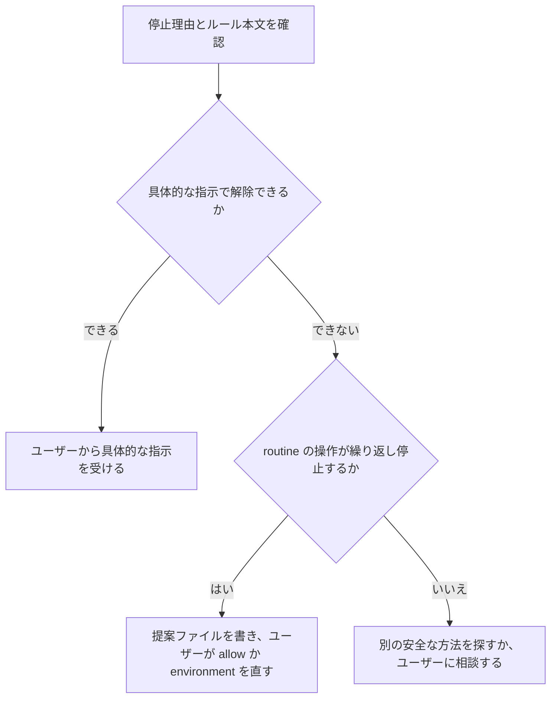

# auto mode の判定と付き合う

Claude Code の auto mode は、ツール呼び出しを classifier（Sonnet 5 が実行する自動判定）に通す。classifier は、取り返しのつかない操作や環境の外部に向かう操作を止める。この文書では、この環境で classifier が確認する内容と、設定の変更場所を説明する。Claude Code はこの文書を常時読み込まない。classifier に止められたときに読む。

## 判定に回るもの、回らないもの

公式資料（https://code.claude.com/docs/en/auto-mode-config）の要点は次のとおりである。

| 呼び出し | auto mode での扱い |
|---|---|
| `permissions.allow` に一致する単純な Bash（`gh pr view 123` など） | classifier を通らず、すぐに許可される |
| `Bash(python3 *)` `Bash(node *)` `Bash(npx *)` `Bash(claude *)` など、任意コードを実行できる allow | auto mode では allow が無効になり、呼び出すたびに classifier に回る |
| `&&` / `;` / パイプ / heredoc でつないだ複合コマンド | allow に一致しないため、classifier に回る |
| Monitor ツール | 常に classifier に回る |
| 作業ディレクトリ内の Read / Edit / Write | classifier を通らずに許可される |
| Agent / SendMessage による委譲 | 依頼文（開始前）、サブエージェントの各操作、終了時の 3 か所で classifier に回る |
| `permissions.deny` / `permissions.ask` | classifier より先に適用される。deny は操作を止め、ask はプロンプトを表示する |

2026-09-29 に直近 7 日の拒否 83 件を確認した。ほぼすべてが、複合コマンドまたは python / node の heredoc だった。classifier を避けるには、1 回の Bash に 1 つの目的だけを割り当てる。ファイルの読み書きには Read / Edit / Write を使う。

## 設定の置き場と反映

- 正本は `~/.config/chezmoi/chezmoi.toml` の `[data.claude.autoMode]` である。`settings.json.tmpl` は、この設定を `autoMode` として出力する
- 設定を反映するには `chezmoi apply ~/.claude/settings.json` を実行する。`settings.json` を jq などで直接書き換えた場合、chezmoi は上書きの確認を求める。`!` から実行する場合は端末がないため、`--force` を付ける
- 有効な設定は `claude auto-mode config` で確認する。組み込みルールの全文は `claude auto-mode defaults` で確認する。`--label 'Merge Without'` はルール名の前方一致で絞り込む
- プロジェクト側の `.claude/settings.json` に書いた `autoMode` は読み込まれない。`autoMode` はユーザー設定にだけ置く
- 開いているセッションは、再起動するまで古い設定で動く

## ルールの書き方

`environment` / `allow` / `soft_deny` / `hard_deny` には、英語の文章を書く。classifier はこれらを自然言語として読む。`Bash(...)` のパターンは使えない。

- `environment`: 信頼する範囲（組織、リポジトリ、バケット、ドメイン、dev 環境、ツール）を、新しく参加したエンジニアに説明するように書く。classifier は、ここに書かれていない対象を「外部」と判断する
- `allow`: 組み込みの `soft_deny` に対する例外を書く。「何が routine で、なぜ停止理由に当たらないか」を、停止するルール名とともに書く。たとえば "not Create Unsafe Agents" と書く。ユーザーが会話で依頼した場合に限ることも明記する
- `soft_deny` / `hard_deny`: この環境で追加して止めたい操作を書く
- どの配列にも `"$defaults"` を残す。外すと、組み込みルールがすべて消える

組み込みルールの多くは、ユーザーが会話で操作を具体的に指示したときに解除される。「片付けて」のような一般的な依頼は、具体的な指示として扱われない。

## 判定が止めたときの手順

1. 停止理由は、ツール結果の `denied by the Claude Code auto mode classifier. Reason: [ルール名]` に表示される。`claude auto-mode defaults --label '<ルール名>'` でルール本文を読む
2. ユーザーの指示で解除できる操作なら、ユーザーにその操作を具体的に指示してもらう。同じ操作を別の経路や小分けで通そうとしない。classifier は、この試みを "Auto-Mode Bypass"（auto mode の回避）として止める
3. routine の操作が繰り返し止まるなら、`allow` または `environment` に書く。ただし、classifier は `autoMode` や `permissions` の変更を "Self-Modification"（設定の自己変更）として止める。Claude は提案ファイルを書く。ユーザーは自分で `chezmoi.toml` を直し、`chezmoi apply` を実行する
4. 拒否履歴を確認するには、`~/.claude/projects/**/*.jsonl` の tool_result を上の文字列で検索する

## Codex 委譲の扱い

Codex プラグインの `codex-companion.mjs` は、Codex を `approval_policy = never` で起動する。classifier はこれを "Create Unsafe Agents"（承認ゲートのないエージェント起動）と判断する。そのため、`environment` に次の内容を書き、classifier の誤解を防いでいる。

- Codex は専用のサンドボックスで動く。サンドボックスは `read-only` であり、`--write` を指定した場合は `workspace-write` である。`danger-full-access` にはならない
- `approval_policy = never` は、承認が必要なツールを拒否する設定である。自動的に承認する設定ではない
- Slack や Google Drive などの連携ツールは、`~/.codex/config.toml` の `[apps.<app id>.tools.<ツール名>] approval_mode = "approve"` で、ユーザーが 1 つずつ事前承認する。Slack の app id とツール名は `docs/codex-config.md` を参照する

2026-09-29 のユーザー判断により、Slack では下書き保存（`slack_send_message_draft`）と送信（`slack_send_message`）までを許可した。予約送信、編集、削除、リアクションは対象外のままである。

## 経緯

- 2026-09-29: 「マージして」と明示した PR の `--admin` マージを、classifier が "Merge Without Review"（レビューなしのマージ）として止めた。`allow` を追加した
- 2026-09-29: Codex 経由の Slack 下書きは、Codex 側の拒否、`config.toml` の変更、再試行という流れで "Auto-Mode Bypass"（auto mode の回避）として止まった。同日に拒否 83 件を確認した。`environment` は wp-platform 専用から組織全体へ書き直した。対象は mationinc / phantom-suzuki / carry-penguin、worktree の保存先、dev 環境、Codex 委譲、dotfiles である。`allow` は 10 件にした。定期実行（CronCreate）からの PR マージも、CI 全緑、Greptile レビュー済み、未解決スレッド 0、指定範囲内の条件で許可した
- 2026-10-05: Slack で依頼された PR の再承認を、`gh api` の review 送信 2 本を 1 回の Bash にまとめて実行した。classifier はこれを理由を示さずに止めた。`permissions.allow` には `Bash(gh *)` があるが、複合コマンドは一致しないので判定に回る。ユーザーの指示で、GitHub の日常操作を `allow` に追加した。対象はレビューと承認、コメントとスレッドの解決、Issue / PR の編集、CI の再実行、dev 向けワークフローの起動である。リポジトリ設定・ブランチ保護・secrets・削除・権限付与・本番デプロイは対象外のまま
- 2026-10-07: 直近 9 日の拒否 116 件の大半は、日常の開発操作の誤判定だった（ローカルのファイル書き込みや heredoc を "External System Writes" / "Instruction Poisoning"、本番の読み取り専用の調査を "Production Reads"、worktree の後始末を "Irreversible Local Destruction" と判定）。ユーザーの指示で `allow` に 5 件を足した。AskUserQuestion で承認された操作を明示の指示として扱う、ローカルの開発操作、本番 AWS の読み取り（秘密の値を除く）、dev の AWS への書き込み、PoC フィードバックの定期実行である。代わりに `permissions.deny` に取り返しのつかない操作（destroy、DB・バケット・ゾーンの削除、リポジトリの削除、`rm -rf ~` など）を、`permissions.ask` に権限と秘密の値の変更（`gh secret set`、`aws iam create-*` など）を足した
