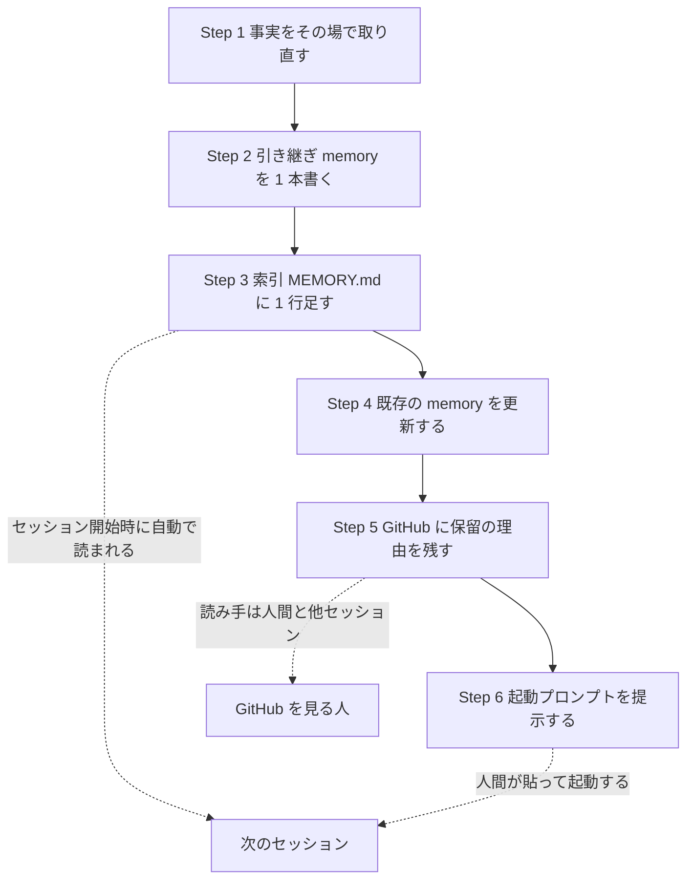

# Session Handover Skill

いま動いているセッションの到達点を **memory に 1 本書き**、次のセッションが**同じ調査を繰り返さず・決まったことを蒸し返さず**続きから入れる状態を作る。最後に次回の起動プロンプトを提示する。

以下では、**次のセッションが最初に着手する作業を「入口」と呼ぶ**。

複数セッションへ**分割**して配るなら、本スキルではなく `session-dispatch`（1 つのアクションプランを複数セッションへ配るスキル）を使う。

## 保存先と、memory に書く理由

```bash
PROJECT_KEY=$(pwd | sed 's|/|-|g')   # 例: /Users/x/work/app -> -Users-x-work-app
MEMORY_DIR="$HOME/.claude/projects/${PROJECT_KEY}/memory"
```

`MEMORY_DIR` は既に在る前提で直接書く（`mkdir` や存在確認は不要）。索引は同じディレクトリの `MEMORY.md`。

memory を使うのは、引き継ぎに必要な 3 つの性質がそろっているからである。

- **索引がセッション開始時に自動で読まれる。** 次のセッションが「読み込むコマンド」を叩かなくても、引き継ぎの存在に気づける
- **上書きされない。** 1 ファイル 1 事実で積み上がるので、過去の判断の根拠が消えない
- **他セッションと共有できる。** 同じプロジェクトを別ウィンドウで開いた並列セッションからも読める

3 つ目の「他セッションと共有できる」があるため、**引き継ぎ先が 1 つに限らない場面でも同じ書き方が通る**。

## 手順

全体の流れは次のとおり。書き先が memory と GitHub の 2 つに分かれるのは、読み手が違うためである。



### Step 1: 事実を集める（記憶で書かない）

引き継ぎ文書の価値は正確さで決まる。誤った到達点を書くと、次のセッションが誤った前提の上に作業を積む。**記憶で書かず、その場で取り直す。**

```bash
git status --short && git log --oneline -5
git worktree list
gh pr list --state open --json number,title,isDraft,mergeStateStatus --jq '.[] | "\(.number) draft=\(.isDraft) \(.mergeStateStatus) \(.title)"'
```

- 「完了した」と書く項目は、その根拠（マージ済みの PR 番号・実測した出力・クローズされた Issue）を持っているか確認する
- 未確認のものは「未確認」と書く。推測を実測のように書かない
- 実行していない検証を「確認済み」と書かない

### Step 2: 引き継ぎ memory を 1 本書く

`$MEMORY_DIR/<name>.md` を作る。`<name>` は kebab-case ではなく既存の命名に合わせる。接頭辞は中身の種類を表す。

| 接頭辞 | 入れるもの |
|---|---|
| `project_` | 進行中の作業や引き継ぎ。**作業の引き継ぎはここ** |
| `reference_` | 調べて分かった事実。外部資料への案内 |
| `feedback_` | ユーザーから受けた指示や進め方の指摘 |

下のテンプレートの節は、どれも「次のセッションが踏む落とし穴」に対応している。空にしてよいのは該当が無い節だけで、面倒だから省くのは避ける。

```markdown
---
name: project_<scope>_handover
description: <担当範囲>の引き継ぎ。<完了したもの>は完了、<保留>は<待ち>で保留。次セッションの入口は<入口>
metadata:
  type: project
---

<1〜2 文で担当範囲と期間。次セッションの入口を太字で 1 行。>

## 完了したこと

| 対象 | 結果 |
|---|---|
| <Issue / PR> | <何をしたか。マージ済みか。実測した値> |

## 保留していること（最重要）

<保留が「品質の問題」なのか「方針判断の待ち」なのかを明示する。> これを書かないと、次のセッションが「出来が悪いから止まっている」と誤解して作り直す。

- 保留の理由と、**保留を解除する条件**
- 対象の worktree とブランチ
- すでに満たしている条件（CI の成功 / レビューの承認 / マージの許可条件）

## 次セッションの入口

<1 つに絞る。> 複数並べると次のセッションが選定から始めてしまう。

### すでに実測済みの事実（再調査しないこと）

| 事実 | 出典（ファイル・行・コミット・実行出力） |
|---|---|

<この節が引き継ぎの中で最も効く。> 調査で分かったことを出典つきで置くと、次のセッションが同じ調査を繰り返さない。

## 未回答の質問（勝手に決めないこと）

1. <ユーザーの判断が必要な論点>

## 残した worktree / ブランチ

| パス | ブランチ | 残すか消すか |
|---|---|---|

## 関連

[[関連 memory]]
```

### Step 3: MEMORY.md に索引行を 1 行足す

索引はセッション開始時に読まれるので、**本文を読まなくても「何が引き継がれているか」が分かる 1 行**にする。本文の内容を索引に書き写さない。

```markdown
- [<タイトル>](<file>.md) — <次セッションが真っ先に知るべき 1 点>
```

同じディレクトリの `MEMORY.md` は**他セッションも編集する**。書き込む直前に読み直し、`Edit` で自分の 1 行だけを差し込む。`Write` で全文を書き直してはならない。読んでから書くまでの間に他セッションが足した行が消えるためである。`Edit` が「一致しない」で失敗したら、それは他セッションが先に書き換えた合図である。上書きに切り替えず、読み直してから差し込み直す。

### Step 4: 既存 memory を更新する（重複を作らない）

同じ範囲を扱う memory が既に在るなら、新規作成ではなくそちらを更新する。特に次の 2 つは食い違うと事故になる。

- 担当表・振り分け表（`session-dispatch` が作るもの）: 自分の枠の行を「完了 / 保留」に直し、引き継ぎ memory へのリンクを足す
- 事実系の memory（`reference_*`）: 今回の実測で覆った記述はその場で直す。古い記述を残したまま新しい memory を足すと、次のセッションがどちらを信じるか分からなくなる

**自分の行・自分が書いた節だけを直す。** 他セッションの記述は消さない。索引に 1 行足す手順（Step 3）と同じ書き方をする。読み直してから `Edit` で該当箇所だけを置き換え、`Write` で全文を書き直さない。

### Step 5: GitHub 側にも残す

memory は自分（Claude）向け、GitHub は人と他セッション向けで、読者が違う。保留中の PR・ブロックされている Issue には、**保留の理由と解除条件**をコメントで残す。memory だけに書くと、GitHub を見た人には理由が見えない。

### Step 6: 起動プロンプトを提示する

最後に、次回そのまま貼れる 1 行を出す。

```text
memory の <name> を読み、<入口の作業> を進めてください
```

- memory 名は正確に書く（索引から本文へ辿れないと意味がない）
- 入口は**言葉で**書く。番号だけにしない（「#1126 を進めて」ではなく「POST を許可する方式の調査（#1126）を進めて」）
- 未回答の質問があるなら、プロンプトと一緒に「起動直後にこの 2 点を聞かれます」と添える

## よくある失敗（避けたいもの）

| 失敗 | 何が起きるか | 防ぎ方 |
|---|---|---|
| 到達点を記憶で書く | 次のセッションが誤った前提で作業を積む | Step 1 で取り直す |
| 「すでに調べたこと」を書かない | 同じ調査を最初からやり直す | 出典つきの実測表を置く |
| 保留の理由を書かない | 出来が悪いと誤解され作り直される | 「品質か方針待ちか」を明示 |
| 入口を複数並べる | 選定から始まって進まない | 1 つに絞る |
| 決定済みの論点を書かない | 蒸し返して再議論になる | 決定と理由を残す |
| 番号だけで指す | 何の話か分からず本文を開く手間が増える | 役割の説明を併記 |
| 未回答の質問を書かない | 次のセッションが勝手に決めて進む | 質問として明示 |

## 関連

- `session-dispatch` — 1 つのアクションプランを複数セッションへ分割して配る場合
- `~/.claude/rules/tool-call-hygiene.md` — 完了報告の前に実在を確認する検証ゲート

## 改訂ログ

- 2026-07-28: 新設。**引き継ぎの既定はこのスキルにする。**
  - 先行するスキルが 2 つある。引き継ぎを書く `handover` と、それを読み込む `takeover` である。この 2 つは `~/.claude/projects/<key>/handover.md` を毎回上書きし、`/takeover` を叩いたときだけ読み込む方式だった
  - 先行する 2 つは非推奨とするが、削除はまだしない。移行の作業は dotfiles の Issue #91 で追跡している
  - 作り直した理由は、Claude Code の memory 機能が育って**索引がセッション開始時に自動で読まれる**ようになったことである。「書くコマンド」と「読み込むコマンド」を対で持つ必要がなくなった
  - 読み込み側の代わりは、本スキルが Step 6 で出す起動プロンプトが担う
