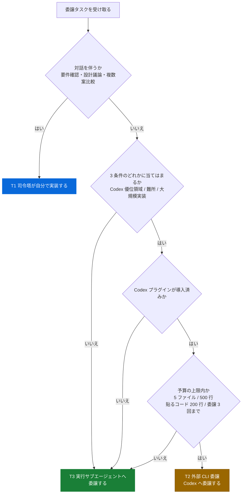

# Task Delegation Skill

実装タスクを受領したとき、Tier 判定を強制実行し、委譲先を決定する。司令塔（セッションのメインモデル）のセッション温存とレートリミット対策のため、コード関連作業はデフォルトで実行役へ委譲する。判定をスキップして Edit/Write/Bash 等を呼ぶのは禁止。

このスキルが委譲体系の**正本**である。`~/.claude/CLAUDE.md` の Task Delegation 節がこのスキルへのポインタとして常時注入される（旧 `~/.claude/rules/task-delegation.md` は、常時読み込みのルール層を減らす作業（dotfiles Issue #69 / PR #86）でソースから削除した。改訂ログは本スキル末尾に移設）。

## 前提: 環境によって委譲体系の実体が変わる（最重要）

委譲マトリクスは**役割ベース**で定義する。各役割を「どのモデル / どのサブエージェントが担うか」は、環境（セッションのモデル構成・Codex プラグインの導入有無）によって変わる。司令塔のモデルは可変（セッションのメインモデルが担う）という前提に立つ。

| 役割 | 実体 |
|------|------|
| T1 司令塔 | セッションのメインモデル |
| T2 外部 CLI 委譲 | Codex（プラグイン導入済み環境のみ。**未導入なら T3 へフォールバック**） |
| T3 実行サブエージェント（軽い実行役） | Sonnet / Haiku 等の軽量モデルの Agent |
| T3 実行サブエージェント（重い実行役） | 上位モデルの Agent（重い実行を切り出す場合） |

- **Codex 導入済み環境**: コード関連作業はデフォルト Codex（T2）へ委譲し、検索・要約等の軽作業は軽い実行役（T3）へ委譲する。
- **Codex 未導入環境**: **T2 を skip** し、T2 相当のコード関連作業も含めてすべて実行サブエージェント（T3）へ委譲する。難度に応じて軽い実行役（定型・大量出力）と重い実行役（中難度・難所）を使い分ける。実行作業に汎用サブエージェントは使わない（高価な司令塔モデルを継承するため）。

この分岐により、委譲体系は Codex の導入有無にかかわらず矛盾なく成立する。

## デフォルト方針

- **コード関連作業はデフォルトで実行役へ委譲する**。規模問わず（10 行未満ルールは撤廃）
- **委譲先の既定は T3 実行サブエージェント**。Codex（T2 外部 CLI 委譲）は下の 3 条件のどれかに当てはまるときだけ選ぶ
  - Codex 優位の領域（自律ターミナル実行 / Web リサーチ / 音声 / 画像生成）
  - 難所（T3 実行サブエージェントが 1 度失敗した / 設計は固まっているが実装難度が高い）
  - 大規模実装（複数ファイルにまたがる新規機能の作り込み）
  - Codex 未導入環境では T2 を選ばない（すべて T3 実行サブエージェントへ回す）
- **レビュー指摘対応・ADR 本文・コメント追加・README 等のドキュメント文章化も委譲対象**
- 司令塔が直接実装するのは**対話を伴う場合のみ**（要件確認、ADR 議論中の探索、複数案比較）
- diff 検証とコミット判断は司令塔（T1）に残す（git-safety.md 継続）
- 委譲オーバーヘッドが大きく見えても、司令塔セッション温存の方が長期的に得

**なぜ既定を T3 実行サブエージェントにしたか**: Codex の週間上限は、Codex Cloud の PR レビューと
ローカル委譲が同じ枠を共有する。2026-07-27 に上限へ達したとき、その日のローカル消費
6,473 万トークンのうち 5,074 万（78%）を委譲パス（`/codex:rescue`）が占めていた。
定型作業まで一律で Codex へ流すと、枠が足りなくなる。詳しくは本スキルの「レート予算の規律」節を読む。

## 着手前必須チェック

ツール呼び出し前に以下を text で提示する:

```
## 委譲判断
- Codex プラグイン: 導入済み / 未導入
- 設計完了: Yes / No（根拠: ADR-XXX / Plan / Issue #NNN）
- コンテキスト限定的: Yes / No（対象ファイル: ...）
- 種別: メカニカル実装 / レビュー対応 / ドキュメント文章化 / 検索・要約 / 設計判断
- 委譲先: T1 司令塔 / T2 外部 CLI（Codex）/ T3 実行サブエージェント（軽い実行役 / 重い実行役）
- 理由: ...
- （Codex 委譲を選ぶ場合のみ）Codex を選ぶ根拠: Codex 優位領域 / 難所 / 大規模実装 のどれか
- （Codex 委譲を選ぶ場合のみ）サイズ: 対象 N ファイル・約 N 行・プロンプトに貼るコード N 行（上限は 5 ファイル / 500 行 / 貼るコード 200 行）
- （Codex 委譲を選ぶ場合のみ）このタスクへの委譲回数: N 回目（上限 3 回）
```

Codex 未導入環境では「委譲先: T2」を選ばない。T2 相当のタスクは T3 実行サブエージェントへ回す。このチェックを省略するのはアンチパターン。

T2 外部 CLI 委譲（Codex）を選ぶときは、根拠・サイズ・回数の 3 行を必ず埋める。埋められないなら T3 実行サブエージェントを選ぶ。上限の詳細は「レート予算の規律」節を読む。

## Tier 定義（役割ベース）

委譲先を決めるまでの流れを図にする。上から順に判定し、最初に当てはまった行き先を選ぶ。

> カラールール: 🔵 司令塔が担当 / 🟡 Codex へ委譲（枠が有限） / 🟢 実行サブエージェントへ委譲（既定）



| Tier | 役割 | 対象タスク |
|------|------|----------|
| T1 | 司令塔（セッションのメインモデル） | 設計判断・横断分析・対話・複数案比較・diff 検証・コミット判断 |
| T2 | 外部 CLI 委譲（Codex。プラグイン導入済み環境のみ。**枠が有限なので選択的に使う**） | Codex 優位の領域（自律ターミナル実行 / Web リサーチ / 音声 / 画像生成）・難所・大規模実装 |
| T3 | 実行サブエージェント（Agent。難度で軽い実行役 / 重い実行役を使い分け）。**コード関連作業の既定** | 実装・テスト・リファクタ・レビュー対応・ドキュメント文章化・検索・要約・フォーマット変換・boilerplate 生成 |

### T1（司令塔が直接）が正当化されるケース

以下に該当する場合のみ司令塔が直接コードを書いてよい:

- 設計判断が未確定（ADR 議論中、方針が複数ある）
- ユーザー対話が必要（「この方針でいいですか？」確認を挟む必要がある）
- 複数案を提示して比較説明する（コード生成より説明が主）
- diff レビュー・最終調整（実行役の出力の検証と微修正）

上記以外で司令塔が直接実装に入るのは**アンチパターン**。

### T2（外部 CLI = Codex 委譲）対象タスク

**Codex プラグイン導入済み環境でのみ有効**。未導入環境では下記タスクを T3 実行サブエージェントへ委譲する。

Codex の週間枠は有限なので、**下記に当てはまるときだけ T2 を選ぶ**。当てはまらないコード関連作業は T3 が既定。

- **Codex 優位の領域**: 自律ターミナル実行（長い試行錯誤を伴うビルド・デバッグ）/ Web リサーチ / 音声入出力 / 画像生成
- **難所**: T3 実行サブエージェントが 1 度失敗した / 設計は固まっているが実装難度が高い
- **大規模実装**: 複数ファイルにまたがる新規機能の作り込み（ただし後述のサイズ上限内に収める）

### T3（実行サブエージェント委譲）対象タスク

**コード関連作業の既定の委譲先**。以下はすべて T3 が担う。

- 関数・メソッド・エンドポイントの実装（設計済）
- テストコード作成（テスト対象と方針は司令塔が指定）
- メカニカルリファクタ（リネーム、import 整理、コールサイト更新）
- **レビュー指摘対応**（CodeRabbit / peer review コメントへの修正）
- **ADR 本文・README・コメント・GoDoc/JSDoc 等のドキュメント文章化**（議論固定後）
- lint/format エラーの一括修正
- マイグレーションファイル生成
- コードベース横断の検索・要約（「この関数の呼び出し元を全部リスト」）
- 既存コードの説明生成
- フォーマット変換（JSON → YAML、テーブル → リスト）
- boilerplate / scaffold の生成
- エラーメッセージの調査・解釈

難度で実行役を使い分ける:

- **軽い実行役**（Sonnet / Haiku 等の軽量モデルの Agent）: 手順が明確な定型作業・大量出力
- **重い実行役**（上位モデルの Agent）: 中難度の作業・難所・軽い実行役からリルートされたケース

## 領域別の得手不得手（Codex ⇔ Claude 分担）

Tier 判定（誰が担うか）とは別の軸として、タスクの**領域**によって Codex と Claude
の優位が分かれる。標準環境で T1 司令塔が自分でやるか T2 Codex へ回すか迷ったら、
この表で優位側に寄せる（根拠は Issue #14 の deep-research。ベンチは短サイクルで
順位が動くため着手時に再確認する）。

> 2026-07 再検証（Issue #14）: 向きはおおむね維持だが、比較の主語は「Fable 5 ⇔ GPT-5.6」に
> 更新。自律ターミナル実行・Web リサーチの Codex 優位は**差が縮小**して拮抗に近づいた可能性、
> ブラウザエージェントの Claude 優位は評価手法の変化で**判定困難**、音声の Fable 5 native 主張は
> **一次情報未確認**。詳細は `~/.claude/docs/codex-config.md` の「2026-07 再検証メモ」を参照。

| 領域 | 優位 | 回し方 |
|------|------|--------|
| 自律ターミナル実行 | Codex | T2 委譲 |
| Web リサーチ | Codex | T2 委譲 |
| 音声入出力 | Codex | T2 委譲 |
| 画像生成（gpt-image 系） | Codex | T2 委譲（Claude 側に手段なし） |
| コーディング精度 | 拮抗 | 通常の Tier 判定に従う |
| ComputerUse（PC 操作） | Claude | 司令塔側で対応 |
| ブラウザエージェント操作 | Claude | 司令塔側で対応 |
| 図表・ビジョン読解 | Claude | 司令塔側で対応 |
| 対話・要件詰め・設計議論・ADR | Claude | T1 司令塔（対話を伴うため） |

- **Codex 優位の領域**（自律実行 / Web リサーチ / 音声 / 画像生成）は、コード関連作業の
  default 委譲に加えて積極的に T2 へ回す。
- **Claude 優位の領域**（GUI 操作 / 図表読解 / 対話設計）は委譲せず司令塔側で扱う。
- **Codex 未導入環境**では Codex 優位領域も委譲先が無いため、T3 実行サブエージェントで
  代替するか司令塔が扱う。ただし画像生成（gpt-image 系）など Claude 側に代替手段が無い
  領域は代替できない旨をユーザーに伝える。

Codex 側の得意領域・分担は Codex の `~/.codex/AGENTS.md`（グローバル指針）にも
明記してあり、委譲時に Codex 自身が自分の役割を認識できるようにしてある。

## Codex 呼び出しテンプレート（T2、導入済み環境のみ）

OpenAI 公式 Codex Plugin (`openai/codex-plugin-cc`) 経由で委譲する。**Bash 直呼び出し (`codex exec`) は使用禁止**（stdin 待ちハング・引数渡し不安定の実害があり、2026-05-14 にプラグイン方式へ移行）。Codex 未導入環境ではこのセクションは適用されない。

### 基本形

`/codex:rescue` の引数として以下の構造でプロンプトを渡す:

```
## タスク
（何を実装/修正/文章化するか）

## コンテキスト
（関連ファイル、インターフェース定義、依存関係。必要最小限）

## 制約
（コーディング規約、使用ライブラリ、避けるべきパターン）
git commit や git push は実行しないこと。

## 完了条件
（テストが通る、lint が通る、特定の動作をする等）
```

### 実行フラグの使い分け

| フラグ | 用途 |
|--------|------|
| （なし） | フォアグラウンド即時実行。短時間タスク向け |
| `--background` | バックグラウンド実行。長時間タスク・並列委譲時 |
| `--wait` | 強制フォアグラウンド |
| `--resume` | 直前の rescue スレッドを継続（追加指示・深掘り時） |
| `--fresh` | 既存スレッド破棄して新規開始 |
| `--model <name>` | モデル指定（例: `gpt-5.3-codex-spark`）。通常は未指定 |

バックグラウンド実行時は `/codex:status`（進捗）、`/codex:result`（結果取得）、`/codex:cancel`（中断）で管理する。

### プロンプト構成のコツ

- コンテキストは Codex の context 制限を意識して必要最小限に絞る
- 1 回の委譲 = 1 つの明確なタスク。複数タスクは個別委譲
- 制約セクションに既存 ADR の参照・rules ファイルへのパスを含めると Codex が AGENTS.md を参照する
- 作業ディレクトリは Codex が cwd を自動認識するため `cd` 不要

## レート予算の規律（委譲サイズと回数の上限）

Codex の週間上限は、Codex Cloud の PR レビューとローカル委譲が**同じ枠**を共有する。
枠を守るため、T2 外部 CLI 委譲（Codex）には以下の上限を課す。

### 1 委譲あたりのサイズ上限

| 項目 | 上限の目安 | 超えたときの対処 |
|---|---|---|
| 渡す対象ファイル数 | 5 ファイル | タスクを分割して個別委譲する |
| 対象の差分・実装量 | 500 行 | 段階に分けて委譲する（設計 → 実装 → テスト） |
| プロンプトに貼るコード | 200 行 | 貼らずにファイルパスだけ渡し、Codex 自身に読ませる |

**プロンプトにコードを貼らない**のが最も効く。Codex は作業ディレクトリを自動で認識してファイルを
読めるため、パスと役割だけ伝えれば足りる。貼り付けたコードは、そのまま入力トークンとして枠を消費する。

### 再委譲の回数上限

同じタスクへの委譲は **3 回まで**。3 回で終わらなければ Codex への委譲をやめる。

| 回数 | やること |
|---|---|
| 1 回目 | 通常どおり委譲する |
| 2〜3 回目 | `--resume` で継続する。**これまでの文脈を丸ごと再送しない**（差分の指示だけ渡す） |
| 4 回目以降 | Codex をやめる。タスクを分割し直して T3 実行サブエージェントへ回すか、司令塔が引き取る |

回数が伸びるときは、たいていタスクの切り方か完了条件の書き方に問題がある。同じ委譲先へ投げ直すより、
タスクを分割し直すほうが早い。

### 消費の実測

今週どれだけ使ったかは、セッションログから測れる。委譲を多く使った日の終わりや、
上限が近いと感じたときに実行する。

```bash
cd ~/.codex/sessions && find . -name '*.jsonl' -newermt '7 days ago' -print0 |
  while IFS= read -r -d '' f; do
    org=$(head -1 "$f" | jq -r '.payload.originator // "unknown"')
    tot=$(jq -rc 'select(.payload.info.total_token_usage != null) | .payload.info.total_token_usage.total_tokens' "$f" 2>/dev/null | tail -1)
    printf '%s\t%s\n' "$org" "${tot:-0}"
  done | awk -F'\t' '{c[$1]++; s[$1]+=$2} END {for (k in c) printf "%-12s sessions=%3d tokens=%10d\n", k, c[k], s[k]}'
```

`originator` の読み方を 2 つあげる。

- `Claude Code` — 委譲パス（`/codex:rescue`）の消費
- `codex_exec` — レビュー系（`self-review` / `peer-review`）の消費

Codex Cloud のレビュー消費は、このログに出ない（Cloud 側で動くため）。ローカルの数字に上乗せがあると考える。

### 上限に達したときの退避

2 つ目のアカウント（`~/.codex-work`）へ手動で切り替える。次のスクリプトが状態確認から設定の共有までを行う。

```bash
bash ~/.claude/skills/codex-account/scripts/setup-work-account.sh --check
```

自動で切り替える仕組みは作らない（委譲先 Codex の常駐プロセスへの割り込みが壊れやすいため）。
手順の詳細は `codex-account` スキルを読む。

なお `401 Unauthorized` が返るのは上限ではなく**ログイン切れ**である。切り分け方は同スキルの
「認証が切れているときの見分け方」節にある。

### 実測の根拠

2026-07-27 に週間上限へ達したときの内訳を記録しておく。

| 経路 | 回数 | 合計トークン | 1 回平均 |
|---|---:|---:|---:|
| 委譲（`/codex:rescue`） | 53 | 5,074 万 | 96 万 |
| レビュー系（`self-review` / `peer-review`） | 5 | 1,400 万 | 280 万 |

平常日は 1 日 347 万トークンだったので、この日は 18.6 倍に跳ねた。データ投入基盤を作る作業ブランチ
（`987-import-pipeline`）だけで委譲が 10 回を超え、1 回あたり 200〜550 万トークンを消費していた。

つまり枠を削ったのは次の 2 つである。上のサイズ上限と回数上限は、この 2 つを直接抑えるために置いている。

- 1 回あたりが重い委譲（平均 96 万・最大 550 万トークン）
- 同じ作業ブランチへの委譲の集中（10 回超）

## 実行サブエージェント委譲のコツ（T3）

Codex 未導入環境で T2 相当タスクを実行サブエージェントへ委譲する場合、Codex 委譲と同じ構造（タスク / コンテキスト / 制約 / 完了条件）でプロンプトを組む。制約セクションに「git commit や git push はしないこと」を明記し、diff 検証とコミット判断は司令塔に残す。

## 安全制約

- **実行役にコミット・プッシュさせない**。Codex 委譲でも実行サブエージェント委譲でも、プロンプト末尾に「git commit や git push は実行しないこと」と明記
- 結果は必ず司令塔（T1）が `git diff` で検証してから受け入れる
- コミット判断はユーザー承認フローに残す（git-safety.md）

## ユーザーへの可視化

委譲先を決定したら、ユーザーに 1 文で報告する:

> 「実装タスクは委譲対象なので、重い実行役のサブエージェントに委譲して実装させます」（既定）
> 「本タスクは自律的な試行錯誤を伴うため、Codex に委譲します（T2 の根拠: Codex 優位領域）」
> 「本タスクは設計判断を含むため司令塔（T1）で自分が実装します（理由: ...）」

## リポジトリ衛生チェック（commit 前 / 完了報告前 必須）

実装作業中に発生した artifact / 大型ファイルが commit に混入しないよう、必ず確認する。実行役（Codex / 実行サブエージェント）へ委譲して実装した場合も、司令塔が diff 検証時に併せて行う:

```bash
# 変更概要
git diff --stat <base>..HEAD

# 大型変更検出（1000 行超の単一ファイル変更）
git diff <base>..HEAD --numstat | awk '$1+$2 > 1000 {print}'

# 意図しない artifact 混入検出
git diff <base>..HEAD --name-only | grep -E '\.terraform/|terraform-provider-|\.DS_Store|node_modules/|\.next/|dist/|build/' && echo "WARN" || echo "OK"
```

**完了報告のセルフチェック AC に必ず以下を含める**:

- [ ] `git diff --stat` の出力に Bin（バイナリ）ファイルなし
- [ ] 単一 commit に 1000 行超の変更がある場合、理由を報告書に明記
- [ ] `.terraform/` / `terraform-provider-*` / `.DS_Store` / `node_modules/` / `dist/` 等の artifact 混入なし

実証: 2026-04-28 セッションで `terragrunt validate clean` のみを AC にしていた teammate が 679MB の Terraform Provider バイナリを commit に混入。team-lead 検証で発覚し cherry-pick 修正 + .gitignore 整備で再構築が必要になった。

## 失敗時のフォールバック

委譲先（Codex / 実行サブエージェント）が期待通りの結果を返さない場合:

1. プロンプトに不足情報を追加して再試行
2. それでも改善しない場合、より強い実行役へリルート（例: 軽い実行役 → 重い実行役、Codex → 司令塔 T1）
3. 規模が大きい場合はタスク分割

## アンチパターン

- **「単発 Issue だから並列化不要 → 司令塔が直接」** ← 並列化要否と委譲要否は独立軸。単発でも委譲対象なら実行役へ
- **「設計読み込み完了 → 自分で書く」** ← 設計が固まったなら次は実行役に渡すフェーズ
- **「400 行くらいなら自分で書いた方が速い」** ← 司令塔トークン浪費の典型。規模が大きいほど委譲効果が大きい
- **「軽微修正だから司令塔が直接」** ← 10 行ルールは撤廃済。対話を伴わない限り委譲
- **「Codex 未導入環境で T2 を選ぶ」** ← 未導入環境では T2 を skip し T3 実行サブエージェントへ回す
- **「コード関連だから、とりあえず Codex（T2）へ」** ← 既定は T3。T2 は Codex 優位領域 / 難所 / 大規模実装の 3 条件のいずれかを満たすときだけ選ぶ
- **「プロンプトに対象コードを全文貼って委譲する」** ← 貼った分がそのまま枠を削る。パスと役割だけ渡して Codex に読ませる
- **「同じタスクに 4 回目以降も Codex を投げ直す」** ← 3 回で終わらないのはタスクの切り方の問題。分割し直して T3 か司令塔へ回す
- **「上限が近いのに実測せず走り続ける」** ← 「レート予算の規律」節の実測コマンドで消費を確認してから判断する
- **「Codex 未導入環境で実行作業に汎用サブエージェントを使う」** ← 高価な司令塔モデルを継承する。必ず軽い実行役 / 重い実行役の専用サブエージェントを使う

## 関連

- `~/.claude/CLAUDE.md` の Task Delegation セクション（概要ポインタ。常時注入されるのはこの 1 節のみ）
- `~/.claude/docs/codex-config.md` — Codex の設定管理と reasoning effort 制御マップの正本。どの呼び出し経路が `config.toml` を尊重するかを載せている。レート消費を調べるときはここから入る
- `~/.claude/rules/git-safety.md`（コミット判断の制約）

## 改訂ログ

旧 `~/.claude/rules/task-delegation.md`（ポインタのみの rule）は、常時読み込みのルール層を減らす作業（dotfiles Issue #69 / PR #86）でソースから削除し、改訂ログを本スキルへ移設した。各マシンに残る実ファイルは別枠で、`.chezmoiremove` に載せてあるので次回の `chezmoi apply` で消える。

- v1（初版）: 10 行未満ルール / レビュー対応は司令塔直接が暗黙
- v2（2026-04-28）: 10 行ルール撤廃、レビュー対応・ADR/コメント等のドキュメント文章化も T2 対象、スキル化
- v3（2026-05-14）: Codex 呼び出しを Bash 直叩きから OpenAI 公式 Codex Plugin (`/codex:rescue`) 経由に移行。stdin 待ちハング・引数渡し不安定を解消
- v4（2026-07-06）: 委譲マトリクスを役割ベース（T1 司令塔 / T2 外部 CLI 委譲 = Codex / T3 実行サブエージェント）に一般化。司令塔のモデルは可変（セッションのメインモデル）とし、Codex 未導入環境では T2 を skip し T3 へフォールバックする分岐を明記。正本をスキルへ統合（Issue #24）
- v5（dotfiles Issue #69 / PR #86）: 常時読み込みのルール層を減らすため、ポインタ rule をソースから削除し改訂ログを本スキルへ集約
- v6（2026-07-28）: Codex の週間上限に達した実測（7/27 の 1 日で 6,473 万トークン、うち委譲パスが 78%）を受けて、コード関連作業の既定の委譲先を T2 Codex から T3 実行サブエージェントへ変更した。T2 は Codex 優位領域 / 難所 / 大規模実装の 3 条件に限定。あわせて「レート予算の規律」節（1 委譲あたりのサイズ上限・再委譲 3 回上限・消費の実測コマンド）を新設した
