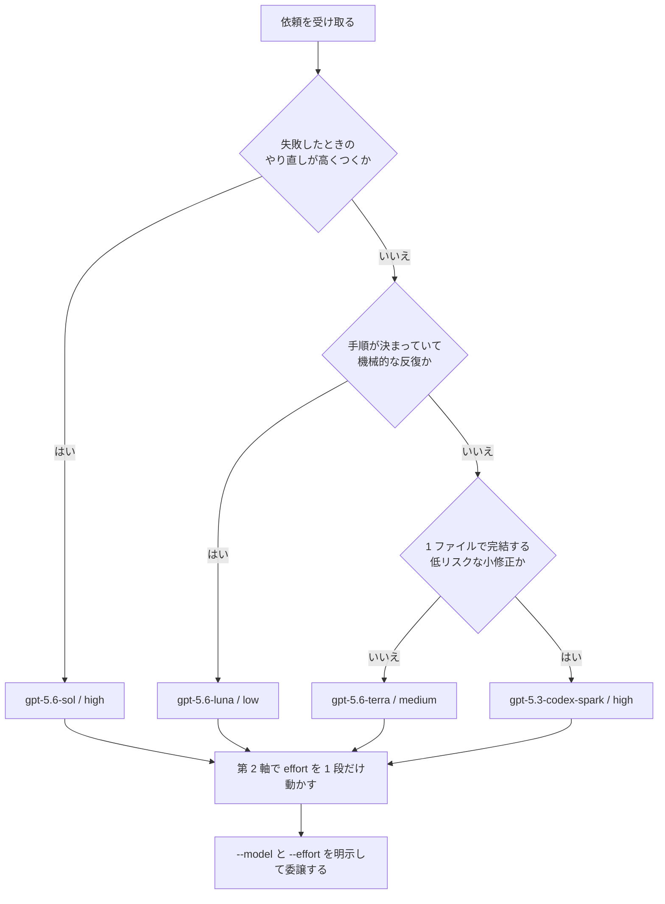

# Codex のモデルと effort のルーティング表

この文書は、Claude Code が Codex へ委譲するときに使う、モデルと reasoning effort の選び方の正本です。
Claude Code は依頼内容をこの表に当てはめ、モデルと effort を毎回明示します。

## 適用範囲

この表が対象にするのは、`/codex:rescue` で委譲する**文章とコードの作業**だけです。実装・テスト・リファクタ・レビュー対応・ドキュメント執筆・Web リサーチが該当します。

次は対象外です。モデルと effort を選ぶ必要はありません。

- 画像生成（`gpt-image-2` を使う別の経路。`codex-imagegen` スキルが担当）
- 音声入出力

## 基本方針

出発点は「バランス既定」です。通常の作業は `gpt-5.6-terra` × `medium` で走らせます。
失敗のやり直しが高くつく作業だけ、上位モデルと高い effort に上げます。手順が決まった機械的な作業は、下位モデルと低い effort に下げます。

OpenAI 公式は `medium` を出発点にするよう勧めています。課題が求める分だけ effort を上げ、`xhigh` を既定にしません。

なお、モデルについて公式が勧める既定は旗艦の `gpt-5.6-sol` です。ここで `gpt-5.6-terra` を既定に置くのは、サブスクの利用枠を守るための**この運用固有の判断**です。品質が足りなければ、下の昇格手順で `gpt-5.6-sol` へ上げます。

## 判定の流れ

上から順に当てはめ、最初に当てはまったところで決めます。



## 第 1 軸: モデルを選ぶ

表は上から順に判定します。先に当てはまった行が勝ちます。

| 順 | 依頼の性質 | モデル | 出発点の effort |
|---|---|---|---|
| 1 | 失敗のやり直しが高くつく作業 | `gpt-5.6-sol` | `high` |
| 2 | 機械的な反復で、すぐ検証できる作業 | `gpt-5.6-luna` | `low` |
| 3 | 1 ファイルで完結する低リスクな小修正 | `gpt-5.3-codex-spark` | `high`（このモデルの既定値） |
| 4 | 上のどれでもない通常作業 | `gpt-5.6-terra` | `medium` |

失敗のやり直しが高くつく作業には、次の依頼が含まれます。

- 設計を伴う実装
- データ移行
- 認証・権限・課金まわりの変更
- 大規模リファクタ
- 原因が分からないバグの根本調査

機械的な反復で、すぐ検証できる作業（`gpt-5.6-luna`）は、次の**すべて**を満たすものだけです。1 つでも欠けたら `gpt-5.6-terra` にします。

- 手順が完全に決まっていて、Codex 側の判断が要らない
- 同じ形の変更を繰り返す
- テストか lint で結果をすぐ確認できる
- 間違えても影響が局所にとどまる

該当する依頼の例を挙げます。

- 一括リネーム
- import 整理
- lint の自動修正
- フォーマット変換
- 定型コメントの付与

仕様が固まっていても、複雑なパーサーや並行処理のように推論の負荷が高い実装は、ここに入れません。`gpt-5.6-terra` で扱います。

1 ファイルで完結する低リスクな小修正（`gpt-5.3-codex-spark`）は、次の**すべて**を満たすものだけです。

- 1 番目の「やり直しが高くつく作業」に当てはまらない
- 変更が 1 ファイルに収まる見込みで、設計の判断を含まない
- 認証・権限・課金・暗号・本番設定のどれにも触れない
- 渡す文脈（対象ファイルと参照資料）が 128k トークンに収まる。超えるときは `gpt-5.6-terra` × `medium` を選ぶ

上のどれでもない通常作業（`gpt-5.6-terra`）には、次の依頼が含まれます。

- 関数やエンドポイントの実装
- テスト追加
- レビュー指摘への対応
- ADR・README の本文執筆

### 表に載っていない依頼の扱い

- **Web リサーチ**は 4 番目の「上のどれでもない通常作業」として扱います。
- **長時間の自律ターミナル実行**は「失敗のやり直しが高くつく作業」として扱います。
- **コードベース横断の検索と要約**は Codex へ回しません。T3 実行サブエージェントの担当です（委譲先の判定は `SKILL.md`）。

### モデルを指定するときの注意

- モデル ID はフル ID で指定します。Codex プラグインが解釈するエイリアスは `spark` の 1 つだけです。
- Codex で使う文脈の広さは、`gpt-5.3-codex-spark` が 128k、GPT-5.6 系が 272k です（API の長文脈設定はこれと別枠）。大きな文脈を渡す依頼に `gpt-5.3-codex-spark` は使いません。
- 前世代の `gpt-5.5` / `gpt-5.4` / `gpt-5.4-mini` は、再現性の検証で世代を固定したいとき以外は使いません。
- **GPT-6 Astra（`gpt-6-astra`）**は、2026-09-03 に公開された最上位モデルです。文脈は 1.05M トークンで、effort は `low`〜`max` に対応します。プラグイン経由では `xhigh` までです。単価は 100 万トークンあたり入力 10 ドル、出力 50 ドルで、`gpt-5.6-sol` の約 2.5 倍です。既定のルーティングには入れず、ユーザーが明示して指示したときだけ使います。

## 第 2 軸: effort を上げ下げする

段は `low` < `medium` < `high` < `xhigh` です。第 1 軸で決めた出発点から、**1 段だけ**動かします。

`gpt-5.3-codex-spark` を選んだ場合は動かしません。出発点の `high` がこのモデルの上限だからです。足りなければ、下の昇格手順で `gpt-5.6-terra` へ移します。

### 1 段上げる

次の条件のうち 2 つ以上に当てはまるとき、effort を 1 段上げます。

- 同じ依頼を一度失敗している
- 実装の細部に決めきれていない点があり、Codex 側で補う必要がある
- 3 ファイル以上の整合を取る必要がある
- 壊れたときの影響が本番環境に及ぶ

2 番目の条件は、**成果物の形を変えない範囲の不確かさ**だけを指します。要件や設計そのものが決まっていない依頼は、そもそも Codex へ委譲しません。司令塔（T1）が対話で詰めます（`SKILL.md` の「T1 が正当化されるケース」）。

**上げる先の上限は `high` です**。この軸から `xhigh` へは上げません。`xhigh` の使いどきは下の節で別に決めます。

### 1 段下げる

`gpt-5.6-terra` × `medium` を選んだ依頼のうち、次のすべてに当てはまるものを `low` へ下げます。

- 手順が決まっていて、Codex 側の判断が要らない
- テストや lint で結果をすぐ確認できる
- 間違えても影響が局所にとどまる

第 1 軸の `gpt-5.6-luna` との違いは「同じ形の変更を繰り返すかどうか」です。反復ではないので `gpt-5.6-luna` には落としませんが、推論の負荷は低いので effort だけ下げます。単発の設定ファイル修正や、決まった書式へのドキュメント整形が当てはまります。

**下限は `low` です**。第 1 軸で `gpt-5.6-luna` を選んだ依頼は、すでに下限なのでこれ以上下げません。

### `xhigh` を使う条件

`xhigh` へは、第 2 軸の 1 段上げでも、失敗したときの昇格でも到達しません。次の 3 つの場面だけ、**最初から** `gpt-5.6-sol` × `xhigh` を指定します。

- 20 ファイル以上に及ぶ自律実行
- セキュリティ監査
- アルゴリズム的に難しい問題

### `none` と `minimal` を使わない理由

`none` と `minimal` は使いません。使えるモデル一覧（`~/.codex/models_cache.json`）には、どちらの記載もありません。
プラグインの検証は通りますが、モデル側が受け取ったときの挙動を確認できていません。下限は `low` とします。

## 呼び出し方

Claude Code は毎回モデルと effort を明示します。Agent ツールで `subagent_type: "codex:codex-rescue"` を呼び、プロンプトの先頭に指定を置きます。

```
--model gpt-5.6-terra --effort medium --background
（ここから タスク / コンテキスト / 制約 / 完了条件 の本文）
```

対話から呼ぶ場合は、`/codex:rescue --model gpt-5.6-terra --effort medium <本文>` を使います。

**なぜ毎回明示するのか**: Codex プラグインは、ユーザーが明示しない限りモデルと effort を指定しません。未指定のまま走らせると、`~/.codex/config.toml` の既定値に落ちます。既定値は依頼内容を見ない固定値なので、重い依頼には足りず、軽い依頼には過剰になります。

`config.toml` の値は、指定漏れが起きたときの保険と位置づけます。

## 失敗したときの昇格

まず**失敗の原因を分けます**。中断・権限エラー・ネットワーク不調のような環境要因なら、モデルを上げずに原因を取り除いて同じ設定で再試行します。Codex の出力が力不足だった場合だけ、次の表に従って上げます。

| 今の設定 | 次に試す設定 |
|---|---|
| `gpt-5.3-codex-spark` × `high` | `gpt-5.6-terra` × `medium` |
| `gpt-5.6-luna` × `low` | `gpt-5.6-terra` × `medium` |
| `gpt-5.6-terra` × `medium` | `gpt-5.6-terra` × `high` |
| `gpt-5.6-terra` × `high` | `gpt-5.6-sol` × `high` |
| `gpt-5.6-sol` × `high` | タスクを分割するか、T1 司令塔へ戻す |
| `gpt-5.6-sol` × `xhigh` | T1 司令塔へ戻す |

再試行のたびに、プロンプトの不足していた情報を補います。設定を上げるだけで同じプロンプトを投げ直しません。

昇格の過程で `xhigh` へは上げません。`xhigh` は前述の 3 場面だけで、最初から指定します。

## 消費の目安

API の単価（100 万トークンあたりのドル。短い文脈の場合。2026-09-04 時点）:

| モデル | 入力 | 出力 |
|---|---|---|
| `gpt-6-astra` | 10 | 50 |
| `gpt-5.6-sol` | 4 | 20 |
| `gpt-5.6-terra` | 2 | 12 |
| `gpt-5.6-luna` | 0.20 | 1.20 |

`gpt-5.6-sol` の現行価格は 2026-11-21 までの期間限定です。それ以降は上がる可能性があるため、この表は定期的に見直します。

**固定の消費比は置きません**。入力と出力で比が変わり（入力なら 20 : 10 : 1、出力なら約 17 : 10 : 1）、実際の消費は依頼ごとのトークン量にも左右されるためです。判断に使う目安は次の 2 点だけにします。

- `gpt-5.6-sol` は `gpt-5.6-terra` のおよそ 2 倍かかる
- `gpt-5.6-luna` は `gpt-5.6-terra` のおよそ 10 分の 1 で済む

サブスクの利用枠でも同じ向きの差が出ます。`gpt-5.6-sol` を既定にすると枠を使い切りやすくなります。

## 判定に迷ったときの目安

「この依頼を Codex が間違えたとき、やり直しにどれだけ手間がかかるか」で選びます。やり直しが安いなら下げます。やり直しが高いなら上げます。

所要時間の長さでは選びません。間違えたときの損害の大きさで決めます。

## 出典

- モデル一覧・各モデルの既定 effort・対応する effort の段・文脈長: 実機の `~/.codex/models_cache.json`（利用可能モデルの一覧。Codex CLI 0.153.4、2026-09-08 取得）
- プラグインが受け付ける effort とモデルのエイリアス: Codex プラグインの `scripts/codex-companion.mjs`（`VALID_REASONING_EFFORTS` と `MODEL_ALIASES`。v1.0.6。許容 effort は前版と同じ）
- 「モデルと effort はユーザーが明示しない限り指定しない」: 同プラグインの `agents/codex-rescue.md`
- `medium` を出発点にする推奨、effort 各段の使いどき、API での `gpt-5.6` が `gpt-5.6-sol` を指すこと: OpenAI Model guidance <https://developers.openai.com/api/docs/guides/latest-model>（2026-09-04 参照）
- 3 モデルの位置づけ: GPT-5.6 の発表 <https://openai.com/index/gpt-5-6/>（2026-09-04 参照）
- GPT-6 Astra の位置づけと API モデル情報: OpenAI の発表 <https://openai.com/index/gpt-6-astra/>、API モデルページ <https://developers.openai.com/api/docs/models/gpt-6-astra>（2026-09-08 参照）
- API の単価と `gpt-5.6-sol` の期間限定価格: OpenAI の料金表 <https://developers.openai.com/api/docs/pricing>（2026-09-04 参照）
